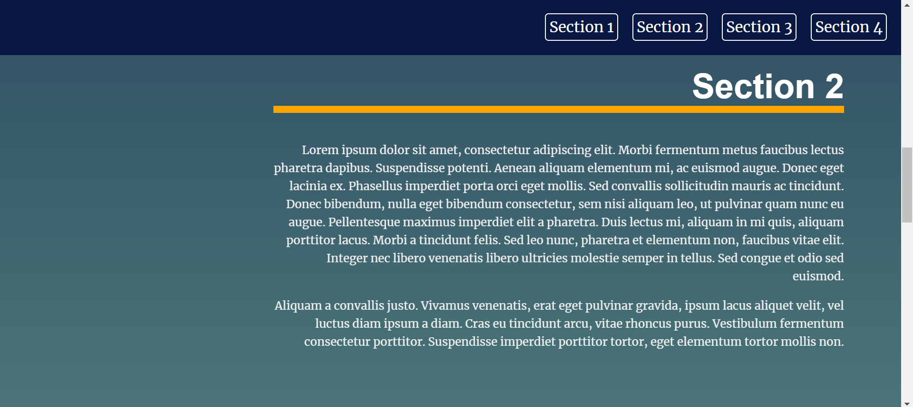

# Landing Page

In this Project, I built a multi-section landing page. Where I learned to dynamically add content to a web page and build a landing page that combines my skills with JavaScript, HTML, and CSS to update and control the page and create a dynamic user experience.

## Tool Used:
HTML

CSS

JavaScript
  * jump.js - A small, modern, dependency-free smooth scrolling library by callmecavs.

